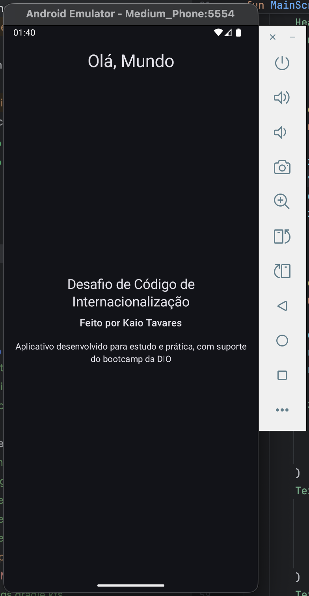
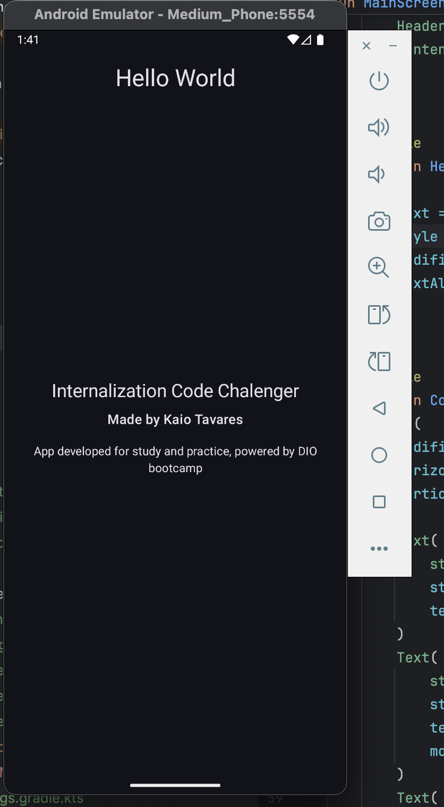
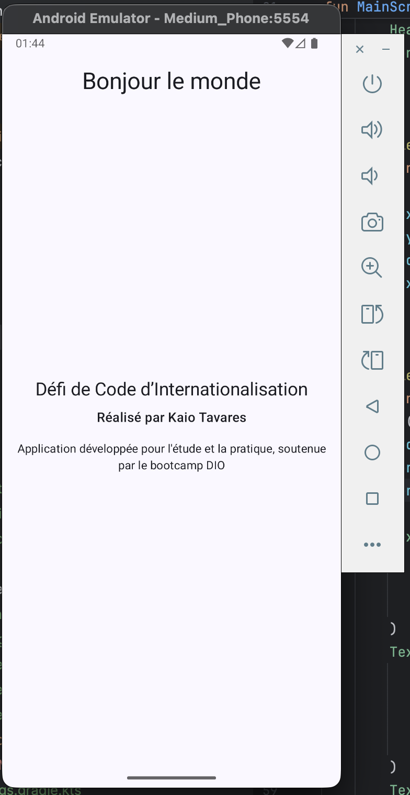
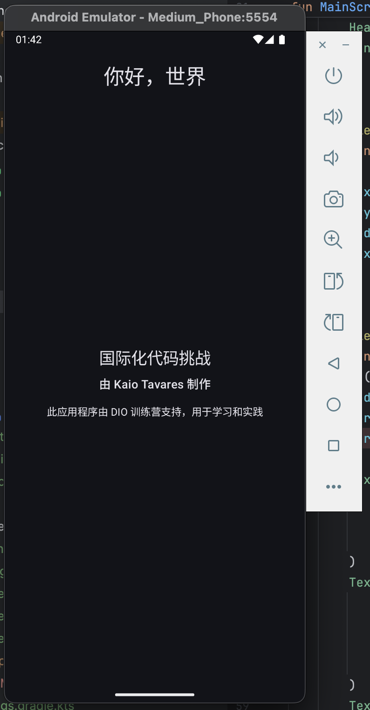
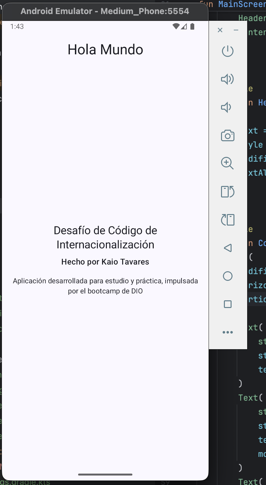

# Criando um App Android com Suporte a Vários Idiomas - Desafio

Este repositório contém um desafio para criar um app Android com uma tela que exibe frases em vários idiomas.

## Idiomas suportados:
- Inglês (en)
- Português (pt-BR)
- Francês (fr)
- Chinês (中文)
- Espanhol (es)

| Português (pt-BR) | English (en) | Français (fr) | 中文 (zh) | Español (es) |
|---|---|---|---|---|
|  |  |  |  |  |

Este projeto é um exercício proposto pelo bootcamp da DIO.