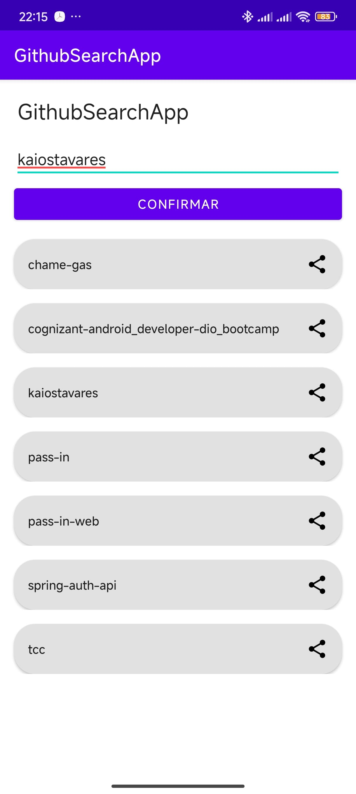
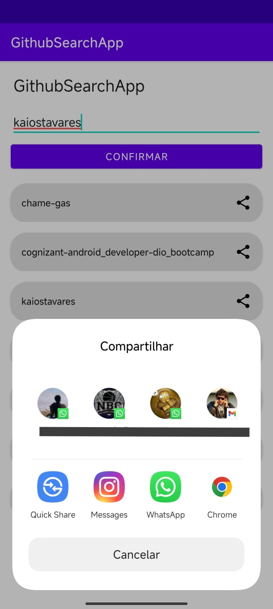

# Criando um App Android para Compartilhar seu Portfólio de Projetos - Desafio
Este repositório contém um desafio para criar um app Android para pesquisas de repositório no Github.

## Funcionalidades
 - Pesquisar repositórios públicos por nome de usuário
 - Compartilhar repositório
 - Acessar repositório

## Screenshots

